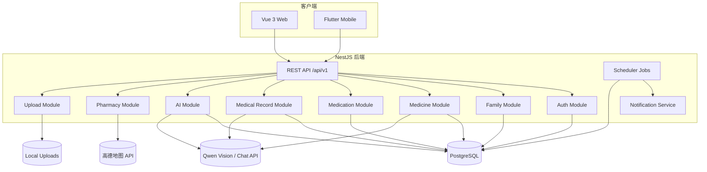

# 家庭健康管家技术架构评估

## 1. 评估结论
当前架构整体是合理的，属于适合**高一学生参赛作品**的**模块化单体 + 多端客户端**方案。  
这里不应按生产系统的标准去要求高可用、分布式拆分、消息队列或复杂运维，而应更看重：
- 功能覆盖是否完整
- 技术点是否有展示价值
- 结构是否清晰，方便讲解
- 演示是否稳定

后端以 NestJS 按业务域拆模块，Web 用 Vue 3 作为管理端，移动端用 Flutter 作为家庭使用端，数据库以 PostgreSQL 为主，AI 能力通过独立服务接入。

这套架构对“家庭健康管家”这种以数据管理、表单录入、提醒、AI 辅助分析为主的产品是匹配的。  
但它也有几个明显的现实问题：
- 通知链路还停留在站内消息/日志级别
- Redis 依赖已出现在依赖列表中，但代码里还没有形成实际使用面
- Web、Backend、Mobile 的工程边界不完全统一
- AI 和 OCR 的结果更偏文本输出，结构化约束还不够强

综合判断：**架构方向正确，工程成熟度中等，适合继续在当前架构上演进，不建议此阶段重构为微服务。**
如果按竞赛作品标准看，这个方案已经足够支撑“完整产品演示 + 技术亮点展示”。

## 2. 现状架构

### 2.1 总体形态
- 根目录采用 pnpm workspace 管理后端和 Web
- 后端是 NestJS 单体服务
- Web 是 Vue 3 SPA
- 移动端是 Flutter 独立应用
- 前后端通过 REST API 通信，统一前缀为 `/api/v1`
- 后端同时承担 API 服务和 Web 静态文件托管

### 2.2 逻辑分层
- 表现层：Web、Mobile
- 接口层：NestJS Controller
- 业务层：各业务 Module / Service
- 数据层：PostgreSQL + TypeORM
- 任务层：Scheduler cron job
- AI 层：Qwen Vision / Chat / Function Calling
- 文件层：本地 uploads 目录

### 2.3 业务模块
- Auth：注册、登录、JWT
- Family：家庭、成员、健康档案
- Medicine：药品、库存、OCR
- Medication：服药计划、打卡、统计
- Medical Record：病历管理、OCR
- AI：问诊、相互作用、服药指南、历史记录
- Pharmacy：附近药店查询
- Scheduler：提醒、临期、漏服任务
- Notification：提醒出口
- Upload：图片上传

## 3. 架构图

## 4. 关键技术决策与合理性

### 4.1 选择 NestJS 模块化单体
**判断：合理**

这是当前最符合产品阶段的选择。系统核心是家庭数据管理、OCR、AI、提醒，这类业务更需要快速迭代和统一事务边界，而不是一开始就引入分布式复杂度。

**优点**
- 业务域划分清晰
- 开发和部署成本低
- 事务处理简单，适合库存扣减、打卡记录等强一致场景
- 后续要拆分服务也容易按模块演进

**代价**
- 单体代码规模会持续增长
- 定时任务、AI、通知都在一个进程里，长期需要关注耦合和启动复杂度

### 4.2 选择 PostgreSQL 作为主存储
**判断：合理**

产品本质是强结构化数据系统，核心数据包括家庭、成员、药品、库存、计划、日志、病历、问诊记录，PostgreSQL 很合适。

**优点**
- 关系数据表达自然
- 事务能力能覆盖库存扣减、打卡记录等场景
- JSONB 适合存 OCR 原始结果和 AI 消息日志

**代价**
- AI 和检索类能力如果继续增长，后续可能需要专门的搜索/向量检索层

### 4.3 选择 REST API 作为统一通信方式
**判断：合理**

Web 和 Mobile 都通过 REST 接口接入，契合当前功能形态。

**优点**
- 简单直接
- 调试成本低
- Web 和移动端共用同一套业务接口

**代价**
- AI 流式输出、站内消息刷新、实时状态同步不够自然
- 如果后续做实时提醒面板，可能要补 WebSocket 或轮询机制

### 4.4 选择 Flutter 作为移动端
**判断：合理**

家庭健康管家这类产品需要跨 iOS / Android，Flutter 可以降低双端维护成本。

**优点**
- 一套代码覆盖双端
- 与 Web 端保持独立演进
- 适合偏表单、列表、提醒类界面

**代价**
- 视觉和交互如果追求和 Web 完全一致，会增加设计与实现成本
- 目前移动端与 pnpm workspace 没有统一管理，工程组织上还不够整齐

### 4.5 AI 以外部服务方式接入
**判断：合理**

OCR、问诊、药物解释依赖模型能力，作为独立外部依赖接入是合适的。

**优点**
- 可快速迭代模型
- Vision 和 Function Calling 能满足当前需求
- 不需要自建推理服务

**代价**
- 强依赖第三方可用性和费用
- 结果稳定性依赖 prompt 和模型输出
- 目前结构化约束不足，容易出现文本化、自由化结果

### 4.6 定时任务与通知服务分离
**判断：方向合理，现状未完成**

用 Scheduler 负责提醒、漏服、临期检查是正确的。  
但通知服务目前还是占位实现，说明架构方向对，落地还不完整。

**建议**
- 先用站内信闭环
- 后续再接短信、邮件或三方推送

### 4.7 Web 静态文件由后端托管
**判断：可接受**

这对当前阶段是务实方案，部署简单。

**优点**
- 一个后端进程即可提供 API + Web
- 上线和本地验证路径简单

**代价**
- 后端和 Web 的发布节奏耦合
- 后续如果要走 CDN 或前后端独立发布，需要重新调整部署方式

## 5. 合理性评分

### 5.1 维度评分
- 业务匹配度：9/10
- 当前阶段适配度：9/10
- 可维护性：7.5/10
- 可扩展性：7/10
- 运维复杂度：8/10

### 5.2 总体判断
当前架构对这个项目是**合理且克制**的。  
它没有过度引入微服务、消息队列和分布式组件，符合当前产品阶段。

真正需要注意的不是“架构选错了”，而是：
- 功能已经进入闭环阶段，工程一致性要跟上
- 站内信、AI 结构化输出、适老化体验需要进一步补强
- 现在不需要做大规模架构重构，更适合把现有功能做完整、做稳、做得好讲

## 6. 主要风险

### 6.1 通知能力风险
- 目前提醒链路未形成真正的消息中心
- 如果后续直接接三方推送，会带来上架、审核和运维复杂度

**建议**
- 先做站内信
- 把通知抽象成统一接口，后续再接外部渠道

### 6.2 AI 输出不稳定
- OCR 和问诊结果偏自然语言
- 结构化约束不足时，前端展示和业务复用会比较难

**建议**
- 让 AI 输出固定 JSON 结构
- 前端做结构化渲染
- 保存原始输出和校验结果

### 6.3 工程边界不完全一致
- pnpm workspace 只管理 backend 和 web
- Flutter 是独立工程
- 这不是问题本身，但需要明确长期协作方式

**建议**
- 明确三端的代码归属和发布边界
- 统一接口契约和字段命名

### 6.4 依赖项“预留多、落地少”
- Redis、socket、通知等依赖已经出现在依赖列表里
- 但实际代码里没有形成完整使用链路

**建议**
- 依赖先按真实使用收敛
- 没有落地之前不要把它写成核心架构能力

### 6.5 参赛表达风险
- 如果文档和展示过度强调生产级能力，容易把重点带偏
- 竞赛评委更容易被“清晰的问题定义 + 完整闭环 + 有亮点的技术实现”打动

**建议**
- 讲清楚家庭健康管家解决什么问题
- 把 OCR、AI、适老化界面、服药闭环作为主要亮点
- 把站内信、提醒、统计作为完整产品链路的一部分

## 7. 结论
这套架构适合当前项目，不需要推倒重来。  
它本质上是一个以 PostgreSQL 为核心、NestJS 模块化单体为骨架、Web 和 Flutter 为双端入口、AI 为外部能力增强的家庭健康管家系统。

如果作为参赛作品，下一步应该做的不是重构架构，而是：
1. 把站内信消息中心补齐
2. 把适老化大字模式做成核心入口
3. 把 AI 输出结构化
4. 把三端契约和工程边界统一起来
